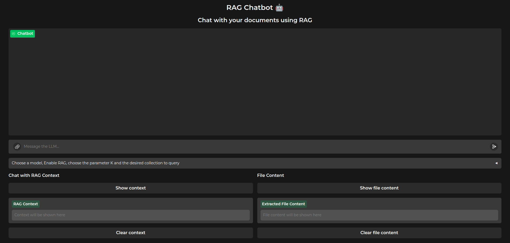
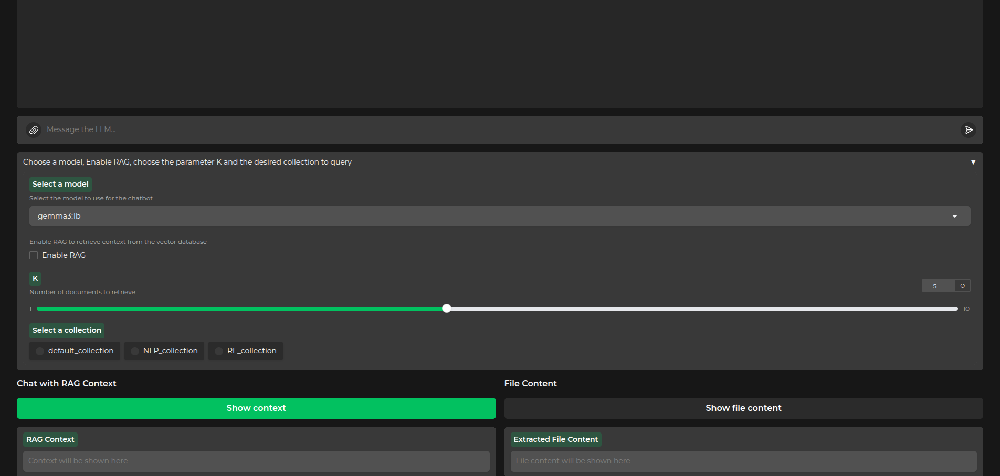
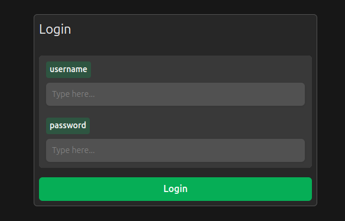

# 🧠 RAG System with LangChain, ChromaDB & Gradio

This project is a **Retrieval-Augmented Generation (RAG)** pipeline combining the power of:

- [LangChain](https://github.com/langchain-ai/langchain) for LLM orchestration  
- [ChromaDB](https://www.trychroma.com/) as the vector database (wrapped with a custom interface)  
- [Gradio](https://www.gradio.app/) for an interactive, user-friendly GUI  

It's designed to let you upload documents, embed them into a vector database, and query them using a language model with contextual awareness.

---

## 🔧 Features

- 📁 **Document Upload & Embedding**  
  Upload PDFs or text files and embed them using an LLM-powered embedding model.

- 🧠 **Vector Search via ChromaDB**  
  A custom wrapper around ChromaDB provides efficient and flexible semantic search.

- 💬 **Context-Aware Q&A Interface**  
  Ask questions and get answers with real-time context retrieval via LangChain.

- 🖥️ **Gradio-Powered GUI**  
  Intuitive interface for uploading files, querying, and visualizing results.

---

## 📸 Screenshots

Here’s a preview of the application in action:

### 🗂️ Document Upload & Processing

### 🔍 Semantic Search

### 🔒 Authentication

## 🚀 Getting Started

### Prerequisites

- Python 3.8+
- [LangChain](https://github.com/langchain-ai/langchain)
- [ChromaDB](https://www.trychroma.com/)
- [Gradio](https://www.gradio.app/)

### Installation

